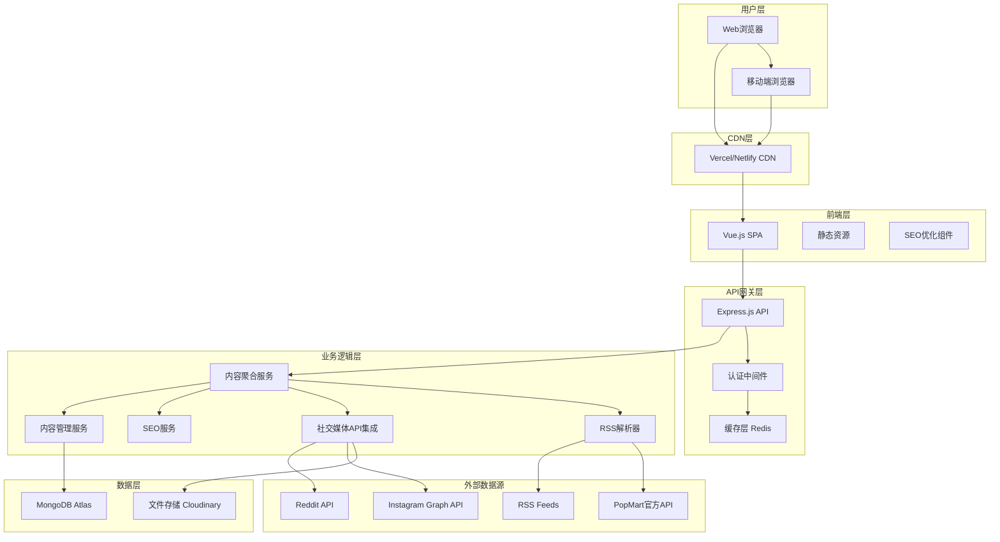
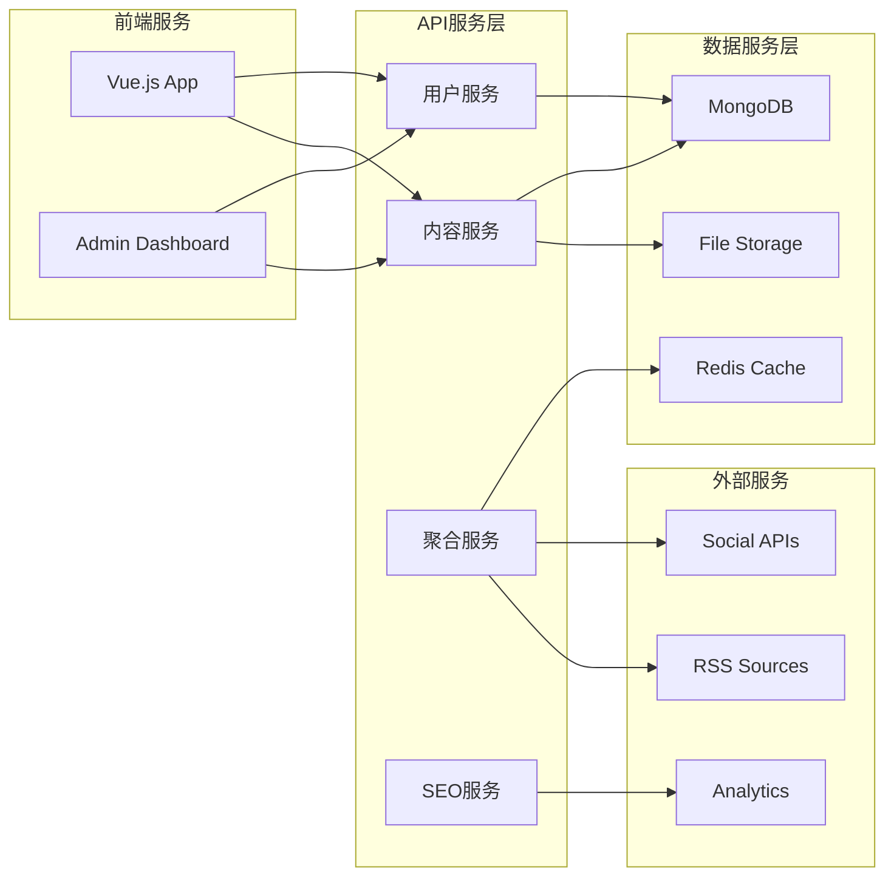
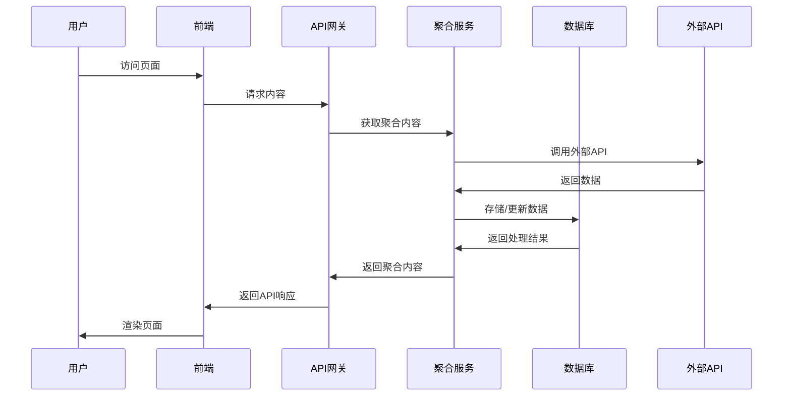
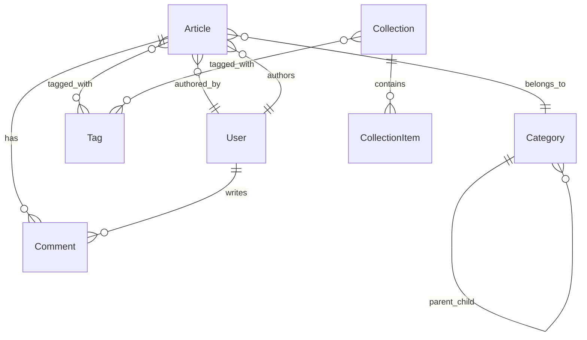
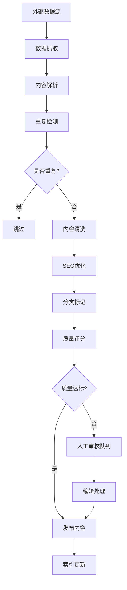
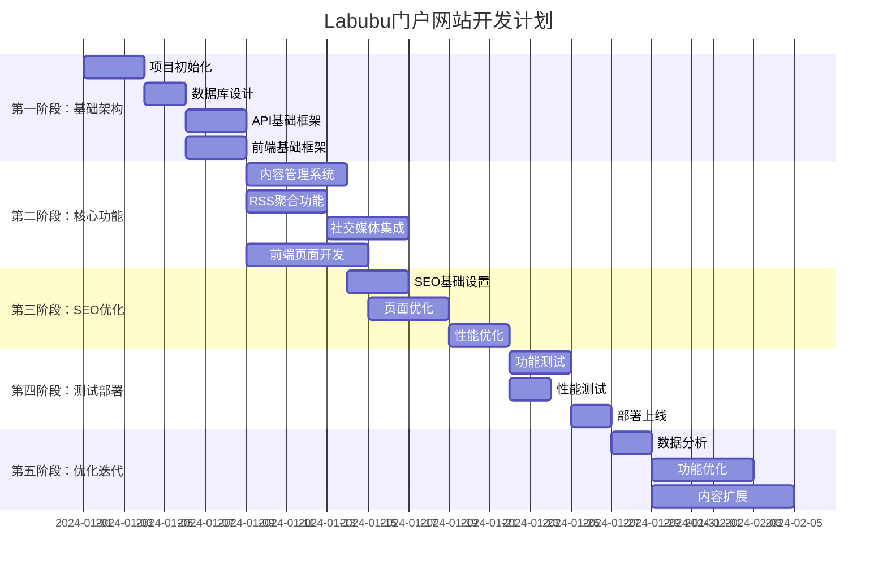
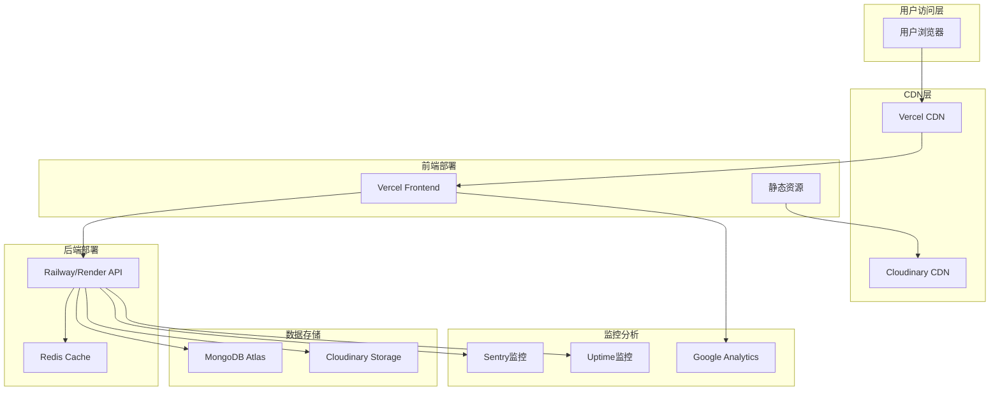

# Labubu资讯门户网站 - 整体架构设计方案

## 1. 项目架构概览



## 2. 技术栈详细选型

### 2.1 前端技术栈
```javascript
// 核心框架
Vue.js 3.x + Composition API
Vue Router 4.x (路由管理)
Pinia (状态管理)
Vite (构建工具)

// UI框架与样式
Tailwind CSS (原子化CSS)
Headless UI (无样式组件)
Framer Motion Vue (动画库)

// SEO优化
Vue Meta (元数据管理)
Vue SSR/Nuxt.js (服务端渲染)
Sitemap生成器

// 性能优化
Vue Virtual Scroller (虚拟滚动)
Vue Lazyload (图片懒加载)
PWA插件
```

### 2.2 后端技术栈
```javascript
// 核心框架
Node.js 18+ LTS
Express.js 4.x
TypeScript (类型安全)

// 数据库与缓存
MongoDB 6.x (主数据库)
Mongoose (ODM)
Redis 7.x (缓存层)

// 认证与安全
JWT (身份验证)
bcrypt (密码加密)
helmet (安全头)
cors (跨域处理)

// 内容处理
RSS Parser (RSS解析)
Cheerio (HTML解析)
Sharp (图片处理)
```

### 2.3 第三方服务集成
```javascript
// 社交媒体API
Instagram Graph API
Reddit API
Twitter API v2

// 云服务
MongoDB Atlas (数据库)
Cloudinary (图片存储)
SendGrid (邮件服务)

// 分析与监控
Google Analytics 4
Google Search Console
Sentry (错误监控)
```

## 3. 系统架构设计

### 3.1 微服务架构图


### 3.2 数据流架构


## 4. 详细文件目录结构

### 4.1 前端项目结构
```
labubu-frontend/
├── public/
│   ├── robots.txt
│   ├── sitemap.xml
│   ├── favicon.ico
│   └── manifest.json
├── src/
│   ├── components/
│   │   ├── common/
│   │   │   ├── Header.vue
│   │   │   ├── Footer.vue
│   │   │   ├── Navigation.vue
│   │   │   ├── SearchBar.vue
│   │   │   └── LoadingSpinner.vue
│   │   ├── content/
│   │   │   ├── ArticleCard.vue
│   │   │   ├── NewsGrid.vue
│   │   │   ├── CollectionGallery.vue
│   │   │   ├── CommunityFeed.vue
│   │   │   └── TrendingTopics.vue
│   │   ├── seo/
│   │   │   ├── MetaTags.vue
│   │   │   ├── StructuredData.vue
│   │   │   └── Breadcrumbs.vue
│   │   └── ui/
│   │       ├── Button.vue
│   │       ├── Modal.vue
│   │       ├── Pagination.vue
│   │       └── ImageLazyLoad.vue
│   ├── pages/
│   │   ├── Home.vue
│   │   ├── News/
│   │   │   ├── NewsIndex.vue
│   │   │   ├── NewsDetail.vue
│   │   │   └── NewsCategory.vue
│   │   ├── Collection/
│   │   │   ├── CollectionIndex.vue
│   │   │   ├── CollectionGuide.vue
│   │   │   └── CollectionDetail.vue
│   │   ├── Community/
│   │   │   ├── CommunityIndex.vue
│   │   │   ├── Discussions.vue
│   │   │   └── Showcase.vue
│   │   ├── Guide/
│   │   │   ├── GuideIndex.vue
│   │   │   ├── BuyingGuide.vue
│   │   │   └── AuthenticityGuide.vue
│   │   └── About.vue
│   ├── stores/
│   │   ├── auth.js
│   │   ├── content.js
│   │   ├── search.js
│   │   └── ui.js
│   ├── utils/
│   │   ├── api.js
│   │   ├── seo.js
│   │   ├── analytics.js
│   │   ├── constants.js
│   │   └── helpers.js
│   ├── assets/
│   │   ├── styles/
│   │   │   ├── main.css
│   │   │   ├── components.css
│   │   │   └── utilities.css
│   │   ├── images/
│   │   └── icons/
│   ├── router/
│   │   └── index.js
│   ├── App.vue
│   └── main.js
├── package.json
├── vite.config.js
├── tailwind.config.js
└── README.md
```

### 4.2 后端项目结构
```
labubu-backend/
├── src/
│   ├── controllers/
│   │   ├── authController.js
│   │   ├── contentController.js
│   │   ├── userController.js
│   │   ├── aggregationController.js
│   │   └── seoController.js
│   ├── models/
│   │   ├── User.js
│   │   ├── Article.js
│   │   ├── Collection.js
│   │   ├── Comment.js
│   │   ├── Category.js
│   │   └── Tag.js
│   ├── routes/
│   │   ├── auth.js
│   │   ├── content.js
│   │   ├── users.js
│   │   ├── aggregation.js
│   │   └── admin.js
│   ├── middleware/
│   │   ├── auth.js
│   │   ├── validation.js
│   │   ├── rateLimit.js
│   │   ├── cache.js
│   │   └── errorHandler.js
│   ├── services/
│   │   ├── aggregationService.js
│   │   ├── rssService.js
│   │   ├── socialMediaService.js
│   │   ├── seoService.js
│   │   ├── emailService.js
│   │   └── imageService.js
│   ├── utils/
│   │   ├── database.js
│   │   ├── redis.js
│   │   ├── logger.js
│   │   ├── constants.js
│   │   └── helpers.js
│   ├── config/
│   │   ├── database.js
│   │   ├── redis.js
│   │   ├── apis.js
│   │   └── environment.js
│   └── app.js
├── tests/
│   ├── unit/
│   ├── integration/
│   └── e2e/
├── docs/
│   ├── api.md
│   └── deployment.md
├── package.json
├── Dockerfile
└── README.md
```

## 5. 数据库设计方案

### 5.1 MongoDB集合设计
```javascript
// 文章集合
const ArticleSchema = {
  _id: ObjectId,
  title: String,
  slug: String, // SEO友好URL
  content: String,
  excerpt: String,
  featuredImage: {
    url: String,
    alt: String,
    caption: String
  },
  author: {
    name: String,
    avatar: String,
    bio: String
  },
  category: ObjectId, // 引用Category
  tags: [ObjectId], // 引用Tag数组
  seo: {
    metaTitle: String,
    metaDescription: String,
    keywords: [String],
    canonicalUrl: String
  },
  source: {
    type: String, // 'rss', 'social', 'manual'
    originalUrl: String,
    platform: String
  },
  status: String, // 'draft', 'published', 'archived'
  publishedAt: Date,
  createdAt: Date,
  updatedAt: Date,
  views: Number,
  likes: Number,
  shares: Number
}

// 分类集合
const CategorySchema = {
  _id: ObjectId,
  name: String,
  slug: String,
  description: String,
  parentId: ObjectId, // 支持多级分类
  seo: {
    metaTitle: String,
    metaDescription: String
  },
  order: Number,
  isActive: Boolean,
  createdAt: Date
}

// 标签集合
const TagSchema = {
  _id: ObjectId,
  name: String,
  slug: String,
  description: String,
  color: String,
  articleCount: Number,
  createdAt: Date
}

// 用户集合
const UserSchema = {
  _id: ObjectId,
  username: String,
  email: String,
  password: String, // 加密存储
  profile: {
    firstName: String,
    lastName: String,
    avatar: String,
    bio: String,
    website: String,
    socialLinks: {
      instagram: String,
      twitter: String,
      reddit: String
    }
  },
  role: String, // 'admin', 'editor', 'user'
  preferences: {
    newsletter: Boolean,
    notifications: Boolean,
    theme: String
  },
  lastLoginAt: Date,
  createdAt: Date,
  isActive: Boolean
}

// 收藏品集合
const CollectionSchema = {
  _id: ObjectId,
  name: String,
  slug: String,
  description: String,
  images: [{
    url: String,
    alt: String,
    isPrimary: Boolean
  }],
  details: {
    series: String,
    releaseDate: Date,
    manufacturer: String,
    material: String,
    size: String,
    rarity: String, // 'common', 'rare', 'ultra-rare'
    estimatedPrice: {
      min: Number,
      max: Number,
      currency: String
    }
  },
  tags: [ObjectId],
  seo: {
    metaTitle: String,
    metaDescription: String
  },
  isActive: Boolean,
  createdAt: Date,
  updatedAt: Date
}
```

### 5.2 数据关系图


## 6. API设计规范

### 6.1 RESTful API设计
```javascript
// 基础API结构
const apiRoutes = {
  // 内容相关
  'GET /api/articles': '获取文章列表',
  'GET /api/articles/:slug': '获取单篇文章',
  'POST /api/articles': '创建文章（需认证）',
  'PUT /api/articles/:id': '更新文章（需认证）',
  'DELETE /api/articles/:id': '删除文章（需认证）',
  
  // 分类相关
  'GET /api/categories': '获取分类列表',
  'GET /api/categories/:slug': '获取分类详情',
  'GET /api/categories/:slug/articles': '获取分类下的文章',
  
  // 标签相关
  'GET /api/tags': '获取标签列表',
  'GET /api/tags/:slug': '获取标签详情',
  'GET /api/tags/:slug/articles': '获取标签下的文章',
  
  // 收藏品相关
  'GET /api/collections': '获取收藏品列表',
  'GET /api/collections/:slug': '获取收藏品详情',
  
  // 搜索相关
  'GET /api/search': '全文搜索',
  'GET /api/search/suggestions': '搜索建议',
  
  // 聚合相关
  'POST /api/aggregation/rss': '手动触发RSS聚合',
  'POST /api/aggregation/social': '手动触发社交媒体聚合',
  
  // 用户相关
  'POST /api/auth/login': '用户登录',
  'POST /api/auth/register': '用户注册',
  'POST /api/auth/logout': '用户登出',
  'GET /api/users/profile': '获取用户资料',
  'PUT /api/users/profile': '更新用户资料',
  
  // SEO相关
  'GET /api/seo/sitemap': '生成站点地图',
  'GET /api/seo/robots': '生成robots.txt',
  'POST /api/seo/reindex': '重新索引页面'
}
```

### 6.2 API响应格式
```javascript
// 成功响应格式
{
  "success": true,
  "data": {
    // 实际数据
  },
  "meta": {
    "pagination": {
      "page": 1,
      "limit": 20,
      "total": 100,
      "totalPages": 5
    },
    "timestamp": "2024-01-01T00:00:00Z"
  }
}

// 错误响应格式
{
  "success": false,
  "error": {
    "code": "VALIDATION_ERROR",
    "message": "请求参数验证失败",
    "details": [
      {
        "field": "title",
        "message": "标题不能为空"
      }
    ]
  },
  "meta": {
    "timestamp": "2024-01-01T00:00:00Z"
  }
}
```

## 7. 内容聚合策略

### 7.1 数据源配置
```javascript
// 内容聚合配置
const contentSources = {
  // RSS源配置
  rss: {
    popmart: {
      url: 'https://popmart.com/rss',
      category: 'official',
      priority: 'high',
      updateInterval: '1h'
    },
    toyNews: {
      url: 'https://toy-news.com/rss',
      category: 'news',
      priority: 'medium',
      updateInterval: '2h'
    }
  },
  
  // 社交媒体API配置
  social: {
    instagram: {
      hashtags: ['#labubu', '#popmart', '#arttoy'],
      accounts: ['popmart_global', 'labubu_official'],
      updateInterval: '30m'
    },
    reddit: {
      subreddits: ['r/funkopop', 'r/toys', 'r/collectibles'],
      keywords: ['labubu', 'popmart'],
      updateInterval: '1h'
    }
  }
}
```

### 7.2 内容处理流程


## 8. SEO优化策略

### 8.1 技术SEO实现
```javascript
// SEO配置
const seoConfig = {
  // 页面元数据
  meta: {
    titleTemplate: '%s | Labubu Portal - Ultimate Labubu News & Collection Guide',
    defaultTitle: 'Labubu Portal - Latest News, Collections & Community',
    description: 'Your ultimate destination for Labubu news, collection guides, and community discussions. Stay updated with the latest Labubu releases and trends.',
    keywords: ['labubu', 'art toys', 'collectibles', 'popmart', 'vinyl toys']
  },
  
  // 结构化数据
  structuredData: {
    organization: {
      '@type': 'Organization',
      name: 'Labubu Portal',
      url: 'https://labubu.news',
      logo: 'https://labubu.news/logo.png'
    },
    website: {
      '@type': 'WebSite',
      url: 'https://labubu.news',
      potentialAction: {
        '@type': 'SearchAction',
        target: 'https://labubu.news/search?q={search_term_string}',
        'query-input': 'required name=search_term_string'
      }
    }
  },
  
  // URL结构
  urlStructure: {
    articles: '/news/{slug}/',
    categories: '/category/{slug}/',
    tags: '/tag/{slug}/',
    collections: '/collection/{slug}/',
    guides: '/guide/{slug}/'
  }
}
```

### 8.2 内容SEO策略
```javascript
// 内容优化规则
const contentSEO = {
  // 标题优化
  titleRules: {
    maxLength: 60,
    includeKeyword: true,
    format: '{keyword} - {description} | Labubu Portal'
  },
  
  // 描述优化
  descriptionRules: {
    maxLength: 160,
    includeKeyword: true,
    callToAction: true
  },
  
  // 内容结构
  contentStructure: {
    h1: 1, // 每页只有一个H1
    h2: '2-6', // 2-6个H2标题
    h3: '适量', // 根据内容长度
    wordCount: '800+', // 最少800字
    imageAlt: '必须', // 所有图片必须有alt标签
    internalLinks: '3-5', // 3-5个内部链接
    externalLinks: '1-2' // 1-2个外部链接
  }
}
```

## 9. 开发阶段规划

### 9.1 开发时间线


### 9.2 里程碑定义
```javascript
const milestones = {
  "M1 - 基础架构完成": {
    "时间": "第1周结束",
    "交付物": [
      "项目基础架构搭建完成",
      "数据库设计文档",
      "API基础框架",
      "前端项目初始化"
    ]
  },
  
  "M2 - 核心功能完成": {
    "时间": "第3周结束", 
    "交付物": [
      "内容管理系统",
      "RSS聚合功能",
      "社交媒体API集成",
      "主要页面开发完成"
    ]
  },
  
  "M3 - SEO优化完成": {
    "时间": "第4周结束",
    "交付物": [
      "SEO基础设置",
      "页面性能优化",
      "移动端适配",
      "搜索引擎友好URL"
    ]
  },
  
  "M4 - 测试部署完成": {
    "时间": "第5周结束",
    "交付物": [
      "功能测试报告",
      "性能测试报告", 
      "生产环境部署",
      "监控系统配置"
    ]
  },
  
  "M5 - 优化迭代": {
    "时间": "第6-8周",
    "交付物": [
      "用户反馈收集",
      "性能优化报告",
      "内容策略调整",
      "SEO效果分析"
    ]
  }
}
```

## 10. 部署架构方案

### 10.1 部署架构图


### 10.2 环境配置
```javascript
// 生产环境配置
const productionConfig = {
  frontend: {
    platform: "Vercel",
    domain: "labubu.news",
    ssl: true,
    cdn: true,
    buildCommand: "npm run build",
    outputDirectory: "dist"
  },
  
  backend: {
    platform: "Railway/Render",
    domain: "api.labubu.news", 
    ssl: true,
    autoScale: true,
    healthCheck: "/api/health",
    environment: {
      NODE_ENV: "production",
      PORT: process.env.PORT || 3000,
      MONGODB_URI: process.env.MONGODB_URI,
      REDIS_URL: process.env.REDIS_URL,
      JWT_SECRET: process.env.JWT_SECRET
    }
  },
  
  database: {
    service: "MongoDB Atlas",
    cluster: "M10",
    region: "us-east-1",
    backup: true,
    monitoring: true
  },
  
  cache: {
    service: "Redis Cloud",
    plan: "30MB",
    region: "us-east-1"
  }
}
```

## 11. 性能优化策略

### 11.1 前端性能优化
```javascript
// 性能优化配置
const performanceConfig = {
  // 代码分割
  codeSplitting: {
    routeLevel: true, // 路由级别分割
    componentLevel: true, // 组件级别分割
    vendorSeparation: true // 第三方库分离
  },
  
  // 缓存策略
  caching: {
    staticAssets: '1y', // 静态资源缓存1年
    apiResponses: '5m', // API响应缓存5分钟
    images: '30d' // 图片缓存30天
  },
  
  // 图片优化
  imageOptimization: {
    formats: ['webp', 'avif', 'jpg'], // 支持的格式
    sizes: [320, 640, 1024, 1920], // 响应式尺寸
    lazyLoading: true, // 懒加载
    placeholder: 'blur' // 模糊占位符
  },
  
  // 预加载策略
  preloading: {
    criticalResources: true, // 关键资源预加载
    nextPagePrefetch: true, // 下一页预取
    imagePreload: 'viewport' // 视窗内图片预加载
  }
}
```

### 11.2 后端性能优化
```javascript
// 后端优化策略
const backendOptimization = {
  // 数据库优化
  database: {
    indexing: {
      articles: ['slug', 'publishedAt', 'category'],
      users: ['email', 'username'],
      tags: ['slug', 'name']
    },
    aggregation: true, // 使用聚合管道
    pagination: true, // 分页查询
    projection: true // 字段投影
  },
  
  // 缓存策略
  caching: {
    redis: {
      articles: '1h', // 文章缓存1小时
      categories: '24h', // 分类缓存24小时
      tags: '12h' // 标签缓存12小时
    },
    memoryCache: {
      config: '1h', // 配置缓存1小时
      routes: '30m' // 路由缓存30分钟
    }
  },
  
  // API优化
  api: {
    compression: true, // 响应压缩
    rateLimit: '100/15m', // 速率限制
    cors: 'optimized', // CORS优化
    etag: true // ETag支持
  }
}
```

## 12. 安全策略

### 12.1 安全配